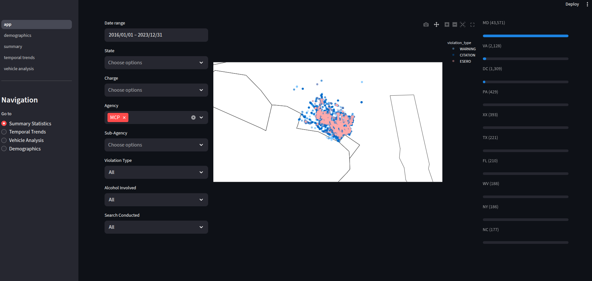
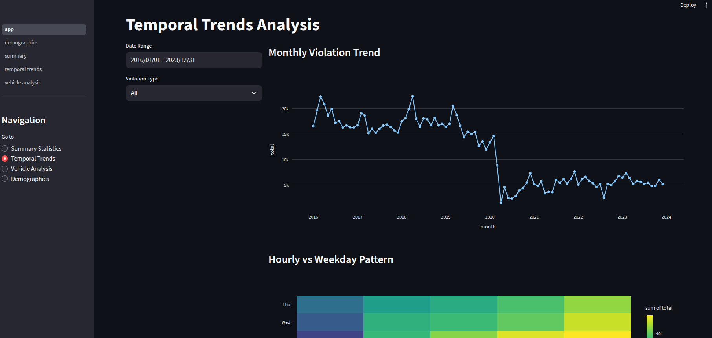
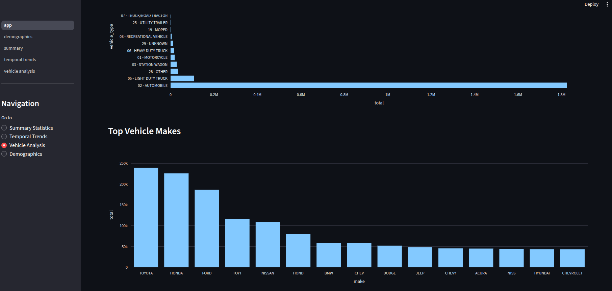
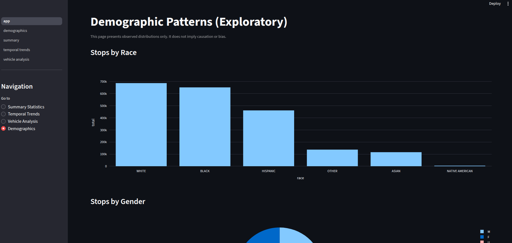
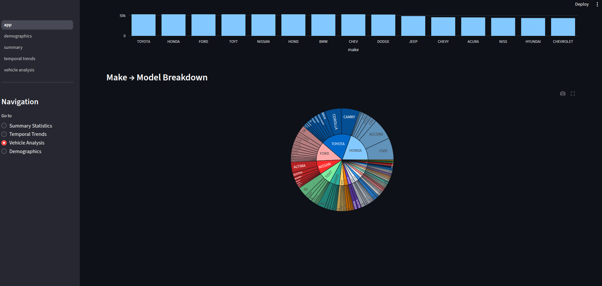
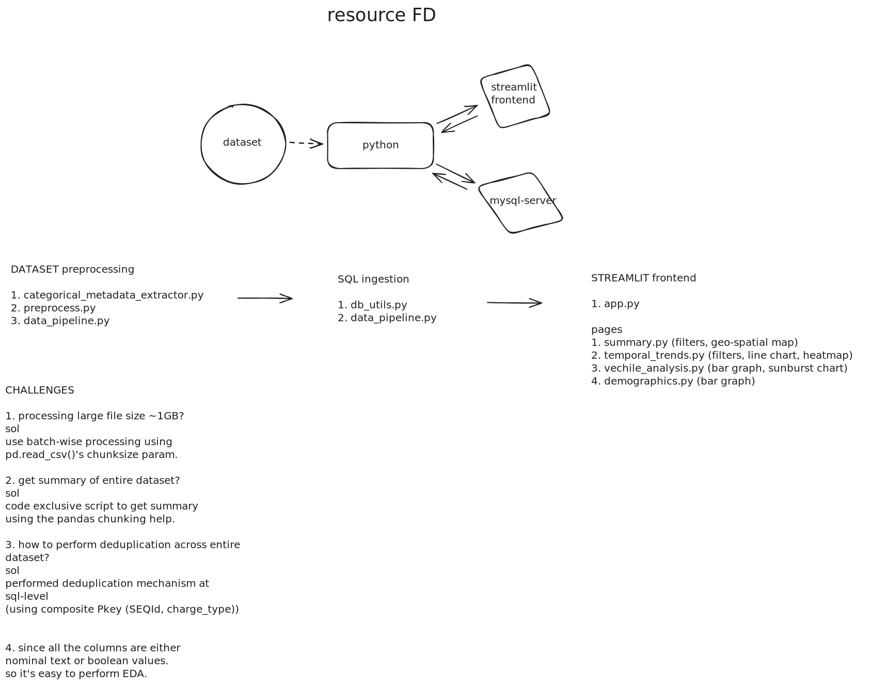

# Sportradar NCAAFB Dashboard

## Overview
A complete data analytics system that transforms a large, raw dataset of traffic violations (≈ 10 lakh rows) into actionable insights through Exploratory Data Analysis (EDA), data cleaning, preprocessing, and an interactive visualization dashboard built with Streamlit

## Dataset & Tech stack

### Dataset
- Link: [traffic_US_dataset](https://drive.google.com/drive/folders/1ZoS_lQQXKwJf-hfp--eLB-hPK5kKIC6k)

### Language / Runtime
- Python >= 3.11 (streamlit compatible version on linux)

### Package manager
- uv (astral)

### Libraries (requirements)
- mysql-connector-python>=9.5.0
- pandas>=2.3.3
- plotly>=6.5.0
- requests>=2.32.5
- ruff>=0.14.6
- sqlalchemy>=2.0.44
- streamlit>=1.51.0
- pyarrow

## Core pages
1. Summary Statistics
2. Temporal Trends
3. Vehicle Analysis
4. Demographics

| | |
|---|---|
|  |  |
|  |  |
|  | |

## Flow Diagram

<!--  -->

## Getting started
1. Create virtual environment:  
     - `uv init`
2. Activate and install:  
     - copy paste './pyproject.toml`
     - `uv sync`
3. Run the app:  
     - `streamlit run ./app.py`

